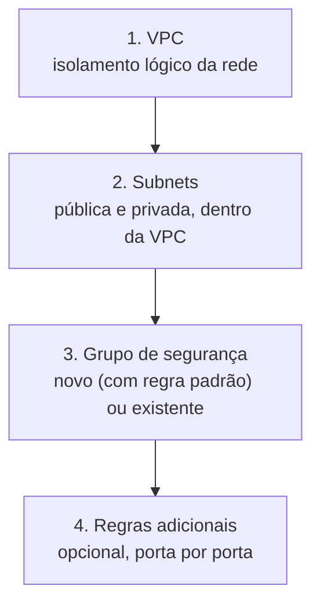

# Proposta — Criação visual de VPC, Subnets e Grupos de Segurança

**Autor:** Agner Loss Rodrigues — Engenharia
**Tipo de contribuição:** Documentação / Especificação de arquitetura (Sprint de Inovação #17)

## 1. Problema

Hoje, provisionar a base de rede de um projeto na Magalu Cloud — VPC, subnets e
grupo de segurança — só é possível via CLI (`mgc`). Não existe um fluxo visual
guiado no console que amarre as quatro etapas em sequência. Isso gera dois
atritos reais, observados em laboratório:

- Quem está começando não tem um caminho óbvio: precisa saber de antemão que
  a ordem é VPC → Subnet → Security Group → Regra, e que subnet não existe
  sem VPC criada primeiro.
- A sintaxe da CLI muda entre versões (`--cidr` vs `--cidr-block`, exigência de
  `--ip-version`, etc.) e a documentação de referência nem sempre acompanha —
  o único jeito confiável de confirmar é `--help` na hora.

## 2. Proposta

Uma tela de criação guiada no console, em 4 etapas obrigatórias e nessa ordem,
onde cada etapa só libera a próxima depois que o recurso anterior existe.

### Por que essa ordem e não uma tela única com tudo junto

Subnet exige `vpc_id` existente; regra exige `security_group_id` existente.
Uma tela única faria a pessoa preencher campos que dependem de IDs que ainda
não existem. O fluxo em etapas resolve isso mostrando só o que já pode ser
preenchido em cada momento, e usa o resultado da etapa anterior para
pré-preencher a próxima (ex: o seletor de VPC na etapa 2 já vem com a VPC
recém-criada selecionada).

## 3. Wireframe textual de cada etapa

**Etapa 1 — VPC**
- Campo: nome da VPC (texto livre, obrigatório)
- Preview do comando equivalente, exibido antes de confirmar (transparência —
  a pessoa vê o que vai rodar, não é caixa-preta)
- Ação: "Criar VPC" → dispara a criação, mostra status (criando → criada)

**Etapa 2 — Subnets** (repetível — recomendar pelo menos 2 execuções: pública e privada)
- Campo: seletor de VPC (pré-selecionado com a criada na etapa 1)
- Campos: nome, CIDR block, zona de disponibilidade
- Mesmo padrão de preview + ação da etapa 1

**Etapa 3 — Grupo de segurança (novo ou existente)**
- Escolha inicial: "Criar novo grupo" ou "Usar grupo existente" (segunda opção
  abre um seletor com os grupos já criados na conta — `network
  security-groups list`)
- Se "Criar novo": campo de nome + um segundo campo obrigatório, **sistema
  operacional da instância** (Linux / Windows), que define a porta de acesso
  administrativo liberada por padrão:
  - Linux → 22/tcp (SSH)
  - Windows → 3389/tcp (RDP)
- Campo de origem da regra padrão, pré-preenchido com o IP de quem está
  criando (editável, para quem quiser liberar de outro IP/CIDR)
- Ao confirmar, a etapa executa duas coisas em sequência: cria o grupo E já
  cria a regra de acesso administrativo restrita a esse IP — o resto
  permanece bloqueado (postura padrão do security group: negação implícita,
  nada mais aberto sem ação explícita)
- Se "Usar grupo existente": só o seletor, sem criar regra nova — assume que
  o grupo escolhido já tem as regras que a pessoa quer

**Etapa 4 — Regras adicionais** (opcional, repetível — uma execução por porta/direção)
- Campo: seletor de grupo de segurança (pré-selecionado com o criado na etapa 3)
- Campos: direção (ingress/egress), protocolo (tcp/udp/icmp/icmpv6), porta
  inicial, porta final, CIDR de origem/destino
- Mesmo padrão de preview + ação

**Elemento transversal — "Ver --help"**
Em toda etapa, um botão secundário roda o `--help` do comando correspondente
e mostra a saída real da CLI. Isso cobre o segundo atrito do problema: a
tela nunca afirma uma sintaxe que pode estar desatualizada — ela pergunta pra
própria CLI, ao vivo, sempre que a pessoa quiser confirmar.

## 4. Mapeamento tela → comando CLI

| Etapa | Comando `mgc` | Observação |
|---|---|---|
| Criar VPC | `network vpcs create --name=<nome>` | Sem CIDR — fica nas subnets |
| Criar subnet | `network vpcs subnets create --vpc-id=<id> --name=<nome> --cidr-block=<cidr> --ip-version=4 --zone=<zona>` | `--ip-version` é obrigatório |
| Listar security groups existentes | `network security-groups list` | Alimenta o seletor de "usar grupo existente" |
| Criar security group | `network security-groups create --name=<nome>` | Não exige `--vpc-id` na criação |
| Criar regra padrão (acesso administrativo) | `network security-groups rules create --security-group-id=<id> --direction=ingress --protocol=tcp --port-range-min=<22 ou 3389> --port-range-max=<22 ou 3389> --remote-ip-prefix=<IP do usuário>/32` | Porta decidida pelo SO escolhido; origem restrita ao IP de quem criou, não `0.0.0.0/0` |
| Criar regra adicional | `network security-groups rules create --security-group-id=<id> --direction=<ingress\|egress> --protocol=<tcp\|udp\|icmp\|icmpv6> --port-range-min=<n> --port-range-max=<n>` | Protocolo `any` não é aceito — precisa escolher um |

> As flags acima foram validadas em laboratório na versão atual da CLI. O time
> de implementação deve tratá-las como ponto de partida, não como contrato
> fixo — daí o botão "Ver --help" na proposta de UI.

## 5. Estados de erro a cobrir

- **Subnet sem VPC selecionada** — bloquear o botão de criar até haver seleção,
  não deixar chegar no backend pra falhar lá.
- **CIDR sobreposto** — a API retorna erro de conflito; a tela precisa exibir
  a mensagem de volta, não só "erro genérico".
- **VPC em `processing`** — depois de criar a VPC, ela leva alguns minutos até
  `created`. A etapa de subnet deve avisar se a VPC selecionada ainda não está
  pronta, em vez de deixar tentar e falhar.
- **Regra duplicada** (mesma porta/direção/protocolo/CIDR) — tratar como
  no-op amigável, não como erro.
- **IP do usuário não detectado automaticamente** — deixar o campo de origem
  em branco exigindo preenchimento manual, nunca cair silenciosamente para
  `0.0.0.0/0`.
- **Grupo existente selecionado sem nenhuma regra de acesso administrativo** —
  avisar antes de avançar (ex: "esse grupo não libera SSH/RDP para nenhuma
  origem — a instância pode ficar inacessível"), sem bloquear, só alertar.

## 6. Segurança

- Nenhuma credencial nova é introduzida — a tela opera sobre a mesma sessão
  autenticada do console.
- Toda ação de criação deve ser auditável (log de quem criou o quê), como já
  é hoje via CLI.
- O botão "Ver --help" só deve rodar `--help` — nunca deve virar um canal para
  rodar comandos arbitrários digitados livremente.

## 7. Fora de escopo desta proposta

- Exclusão de recursos pela mesma tela (fluxo só de criação por enquanto).
- Edição de VPC/subnet/SG existentes.
- Visualização gráfica da topologia criada (poderia ser uma evolução natural
  depois que a criação guiada existir).

## 8. Handoff para o time de implementação

Este documento descreve o fluxo e o contrato de dados; a escolha de stack
(frontend do console, chamadas internas à API de rede) fica a critério de
quem for implementar. Ponto de partida sugerido: internamente o console já
deve ter acesso à mesma API que a CLI `mgc` consome — a criação guiada é uma
camada de UX sobre essa API, não um novo backend.
