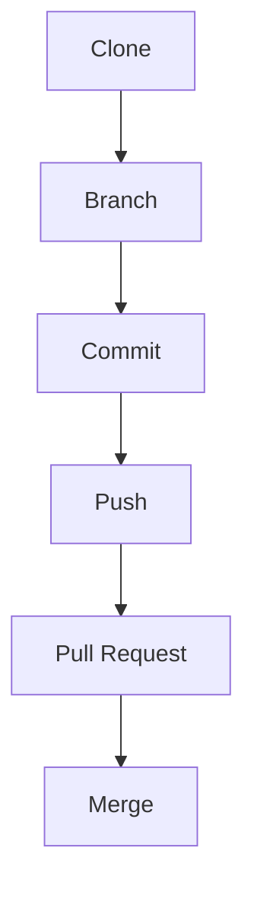

# Fluxo de Trabalho Git (Clone -> Branch -> Commit -> Push -> Pull Request -> Merge)

## Fluxo Resumido (visão rápida da ordem obrigatoria)

```mermaid
flowchart TD
    A[Clone] --> B[Branch]
    B --> C[Commit]
    C --> D[Push]
    D --> E[Pull Request]
    E --> F[Merge]
```

## Fluxo Completo (detalhado)

```mermaid
flowchart TD
    START([Inicio]) --> R1[Receber tarefa ou issue]
    R1 --> C1[Clone do repositorio remoto]
    C1 --> C2[Configurar repositorio local]
    C2 --> C3[Atualizar refs remotas e conferir branch base]

    C3 --> B1[Criar branch de trabalho]
    B1 --> B2[Padrao de nome: tipo/escopo-descricao]
    B2 --> B3[Implementar alteracoes pequenas e focadas]

    B3 --> V1{Mudanca funciona localmente?}
    V1 -- Nao --> V2[Corrigir codigo, docs ou testes]
    V2 --> B3
    V1 -- Sim --> S1[Selecionar arquivos da mudanca]

    S1 --> CM1[Commit atomico com mensagem clara]
    CM1 --> CM2[Formato sugerido: tipo: resumo curto]
    CM2 --> P1[Push para branch remota]

    P1 --> P2{Primeiro push da branch?}
    P2 -- Sim --> P3[Definir upstream e publicar branch]
    P2 -- Nao --> P4[Atualizar branch remota com novos commits]
    P3 --> PR1[Abrir Pull Request para a branch developer]
    P4 --> PR1

    PR1 --> PR2[Descrever contexto, objetivo e validacao]
    PR2 --> PR3[Solicitar revisao]
    PR3 --> PR4{Aprovado?}

    PR4 -- Nao --> FB1[Receber feedback]
    FB1 --> FB2[Aplicar ajustes]
    FB2 --> CM1

    PR4 -- Sim --> M1[Merge na branch developer]
    M1 --> M2[Apagar branch remota opcionalmente]
    M2 --> M3[Sincronizar ambiente local]
    M3 --> END([Fim])
```