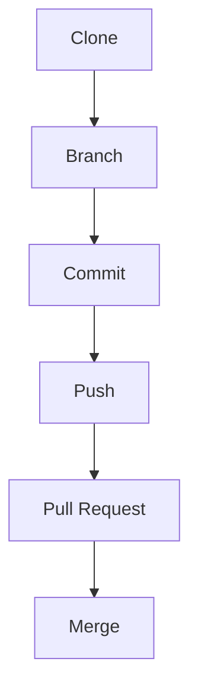
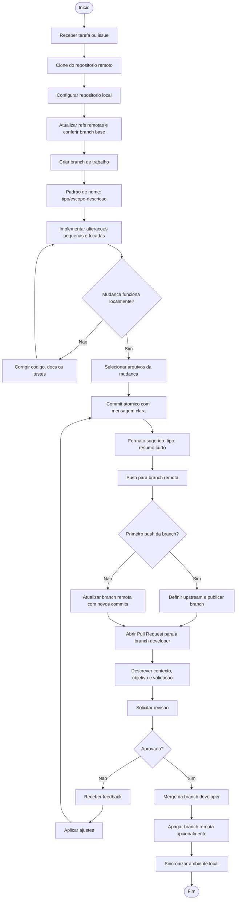

# Git Workflow - Fluxo de Desenvolvimento

Documentação do fluxo de trabalho com Git e GitHub.

---

## 📋 Fluxo Completo

Clone -> Branch -> Commit -> Push -> Pull Request -> Merge

### 1️⃣ Clone

Clona o repositório remoto para sua máquina local.

```bash
git clone https://github.com/usuario/repositorio.git
```

### 2️⃣ Branch

Cria uma nova branch para desenvolver sua feature ou correção.

Criar e mudar para nova branch

```bash
git checkout -b nome-da-branch
```

Ou criar branch e depois mudar

```bash
git branch nome-da-branch
git checkout nome-da-branch
```

### 3️⃣ Commit

Adiciona as alterações e faz o commit com uma mensagem descritiva.

Adicionar arquivos específicos

```bash
git add arquivo.js
```

Adicionar todos os arquivos modificados

```bash
git add .
```

Fazer o commit

```bash
git commit -m "feat: descrição clara da alteração"
```

### 4️⃣ Push

Envia os commits locais para o repositório remoto.

```bash
git push origin nome-da-branch
```

### 5️⃣ Pull Request

Abre um Pull Request no GitHub para solicitar a revisão e mesclagem do código.

Passos:

Acesse o repositório no GitHub

Clique em "Pull Requests"

Clique em "New Pull Request"

Selecione sua branch → branch principal (main/master)

Adicione título e descrição

Solicite revisores

Clique em "Create Pull Request"

### 6️⃣ Merge

Após a revisão e aprovação, o código é mesclado à branch principal.

Na branch principal (local)

```bash
git checkout main
git pull origin main
git merge nome-da-branch
```

Ou via GitHub (recomendado)
Clique em "Merge Pull Request" na interface do GitHub
# Fluxo de Trabalho Git (Clone -> Branch -> Commit -> Push -> Pull Request -> Merge)

## Fluxo Resumido (visão rápida da ordem obrigatoria)



## Fluxo Completo (detalhado)


