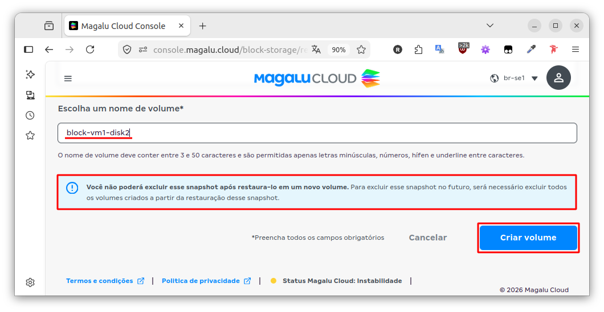

# Proposta de melhoria da documentação da página “Restaurar snapshot em novo volume”.

**Objetivo:** Agreguar valor ao ecossistema da Magalu Cloud.

**Problema:** Ao restaurar um snapshot de um blockstorage, a página **“Restaurar snapshot em novo volume”** exibe uma mensagem incorreta abaixo do campo de texto **“Escolha um nome de volume”**.

A mensagem em questão diz:

> Você não poderá excluir esse snapshot após restaurá-lo em um novo volume. Para excluir esse snapshot no futuro, será necessário excluir **todos os volumes criados a partir da restauração desse snapshot**.

A imagem abaixo exibe um printscreen da tela:

**Detalhamento:** Ao restaurar um snapshot de um blockstorage, um novo volume é criado. Nesse ponto, existirá dois discos na máquina:
- Disco Original	- que deu origem ao snapshot.
- Disco Novo		- que foi criado a partir da restauração do snapshot.

De acordo com a mensagem de warning, só é possível excluir o snapshot **após excluir o Disco Novo** (que foi criado a partir da restauração do snapshot).

Entretanto, isso não faz sentido e não procede. Testes realizados mostram que é perfeitamente possível excluir o snapshot sem remover o **Disco Novo**. E após excluir o snapshot, é possível também remover o Disco Original.

**Sugestão de melhoria:** Excluir a mensagem. Ela confunde o usuário e não corresponde com a realidade.